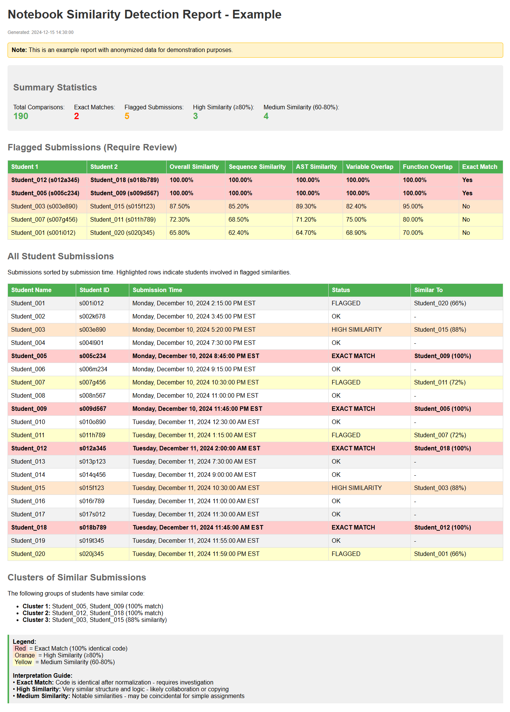

# Notebook & Python File Similarity Detector

A powerful Python tool for detecting similar or identical submissions in Jupyter notebooks and Python files. Perfect for educators and TAs who need to check for potential plagiarism in programming assignments.

## Example Report



*Sample output showing similarity detection between multiple code submissions*

## Blackboard LMS Integration

This tool is specifically designed to work with assignments downloaded from Blackboard LMS:

1. **Download submissions from Blackboard**:
   - Go to your assignment in Blackboard
   - Click "Grade Center" → Select the assignment column
   - Click "Assignment File Download" → "Select Students" → "Submit"
   - Choose "Download assignments as a single zip file"
   - Extract the zip file to a folder

2. **Run the similarity detector**:
   ```bash
   # Navigate to the extracted folder
   cd /path/to/extracted/submissions
   
   # Run the detector (it will automatically find all .ipynb and .py files and read student info from .txt files)
   python /path/to/notebook_similarity_package/run_similarity_check.py .
   
   # Or if installed as a package
   notebook-similarity .
   
   # To analyze only Python files
   notebook-similarity . --types .py
   
   # To analyze both notebooks and Python files explicitly
   notebook-similarity . --types .ipynb .py
   ```

3. **What the tool expects**:
   - Each student submission should include either:
     - A `.ipynb` (Jupyter notebook) file, or
     - A `.py` (Python) file
   - Blackboard automatically creates accompanying `.txt` files with student information (name, ID, submission time)
   - The tool will parse these `.txt` files to identify students
   - File naming patterns from Blackboard: 
     - Notebooks: `AssignmentName_studentid_attempt_date_time_notebook.ipynb`
     - Python files: `AssignmentName_studentid_attempt_date_time_script.py`

## Features

- **Support for Multiple File Types**:
  - Jupyter notebooks (`.ipynb`)
  - Python files (`.py`)
  - Can analyze both types in the same directory

- **Multiple Detection Methods**:
  - Exact code matching using MD5 hashes
  - Sequence similarity analysis
  - Abstract Syntax Tree (AST) comparison
  - Token overlap analysis (variables, functions, imports)
  - Longest common substring detection

- **Parallel Processing**: Utilizes multiple CPU cores for fast analysis
- **HTML & CSV Reports**: Beautiful reports with color-coded similarity levels
- **Cluster Detection**: Identifies groups of similar submissions
- **Flexible Input**: Works with or without accompanying metadata files

## Installation

### Option 1: Install as Package

```bash
# Clone or download the package
cd notebook_similarity_package

# Install the package
pip install .

# Or install in development mode
pip install -e .
```

### Option 2: Install from Requirements

```bash
pip install -r requirements.txt
```

## Usage

### Quick Start for Blackboard Downloads

After downloading and extracting assignment submissions from Blackboard:

```bash
# Option 1: Using the standalone runner (no installation needed)
python /path/to/notebook_similarity_package/run_similarity_check.py /path/to/blackboard/submissions

# Option 2: After installing the package
notebook-similarity /path/to/blackboard/submissions

# The tool will:
# - Automatically find all .ipynb and .py files
# - Parse student names and IDs from Blackboard's .txt files
# - Generate similarity reports in the same directory
```

### Command Line Interface

After installation, use the `notebook-similarity` command:

```bash
# Analyze all notebooks and Python files in current directory
notebook-similarity .

# Analyze specific directory
notebook-similarity /path/to/submissions

# Analyze only Python files
notebook-similarity /path/to/submissions --types .py

# Analyze only notebooks
notebook-similarity /path/to/submissions --types .ipynb

# Analyze both explicitly
notebook-similarity /path/to/submissions --types .ipynb .py

# Set custom similarity threshold (default: 0.7)
notebook-similarity /path/to/submissions --threshold 0.8

# Compare two specific files (can be .ipynb or .py)
notebook-similarity --compare file1.py file2.ipynb

# Specify output directory for reports
notebook-similarity /path/to/submissions --output /path/to/output

# Use fewer workers for parallel processing
notebook-similarity /path/to/submissions --workers 4

# Analyze without looking for .txt metadata files
notebook-similarity /path/to/submissions --no-txt

# Quiet mode (suppress progress messages)
notebook-similarity /path/to/submissions --quiet
```

### Python API

```python
from notebook_similarity import analyze_directory, NotebookSimilarityDetector

# Quick analysis of a directory (analyzes both .ipynb and .py by default)
detector, results_df, clusters = analyze_directory(
    directory_path="/path/to/submissions",
    similarity_threshold=0.7,
    output_dir="/path/to/output"
)

# Analyze only Python files
detector, results_df, clusters = analyze_directory(
    directory_path="/path/to/submissions",
    file_types=['.py'],
    similarity_threshold=0.7
)

# Custom analysis with more control
detector = NotebookSimilarityDetector(
    folder_path="/path/to/submissions",
    num_workers=4,
    include_txt_files=True,
    file_types=['.ipynb', '.py']  # Specify which file types to analyze
)

detector.load_submissions()
detector.analyze_similarities(similarity_threshold=0.8)
clusters = detector.find_clusters()
df = detector.generate_report("custom_report.html")

# Compare two specific files (can be .ipynb or .py)
from notebook_similarity.analyzer import quick_check
result = quick_check("file1.py", "file2.ipynb")
```

### Direct Script Usage (Without Installation)

If you don't want to install the package, you can use it directly:

```python
import sys
sys.path.append('/path/to/notebook_similarity_package')

from notebook_similarity import analyze_directory

# Use as normal
detector, df, clusters = analyze_directory("/path/to/notebooks")
```

## Output

The tool generates reports in the same directory as the analyzed files:

1. **HTML Report** (`similarity_report.html`): 
   - Summary statistics
   - Flagged submissions table with file type indicators
   - Color-coded by similarity level:
     - Red: Exact matches (100% identical)
     - Orange: High similarity (≥80%)
     - Yellow: Medium similarity (60-80%)
   - Shows student names, IDs, and submission times (when available)

2. **CSV File** (`similarity_report.csv`):
   - Detailed data for all comparisons
   - Can be imported into Excel or other tools for further analysis

## Similarity Metrics

The tool calculates multiple similarity metrics:

- **Overall Similarity**: Weighted average of all metrics
- **Sequence Similarity**: Character-level similarity of normalized code
- **AST Similarity**: Structural similarity of Abstract Syntax Trees
- **Variable Overlap**: Percentage of shared variable names
- **Function Overlap**: Percentage of shared function names
- **Import Overlap**: Percentage of shared import statements

## Performance

- Uses parallel processing to speed up analysis
- Automatically uses all available CPU cores
- Can process hundreds of notebooks in seconds

## Requirements

- Python 3.7+
- pandas >= 1.3.0
- numpy >= 1.21.0

## Portable Usage

To use this tool in any directory without installation:

1. Copy the entire `notebook_similarity_package` folder to a USB drive or cloud storage
2. In your Python script or notebook:

```python
import sys
sys.path.insert(0, '/path/to/notebook_similarity_package')
from notebook_similarity import analyze_directory

# Analyze current directory
analyze_directory(".")
```

Or use the CLI directly:

```bash
python /path/to/notebook_similarity_package/notebook_similarity/cli.py /path/to/notebooks
```

## License

MIT License

## Example Workflow for Educators

1. **Assign a programming assignment in Blackboard** (accepts .ipynb or .py files)
2. **After the deadline, download all submissions**:
   - Blackboard → Grade Center → Download Assignment Files
3. **Extract the downloaded zip file** to a folder
4. **Run the similarity detector**:
   ```bash
   # For mixed submissions (notebooks and Python files)
   python notebook_similarity_package/run_similarity_check.py extracted_submissions/
   
   # For Python-only assignments
   notebook-similarity extracted_submissions/ --types .py
   ```
5. **Review the HTML report** (`similarity_report.html`):
   - Red highlights = Exact copies (100% match)
   - Orange = High similarity (≥80%)
   - Check clusters for groups of students with similar code
   - File type column shows whether submission was .ipynb or .py
6. **Investigate flagged submissions** by comparing the original files

## Interpreting Results

- **Exact Matches (100%)**: Identical code after normalization - likely copied
- **High Similarity (80-99%)**: Very similar structure and content - requires review
- **Medium Similarity (60-80%)**: Some similarities - may be coincidental for simple assignments
- **Clusters**: Groups of 3+ students with similar code - investigate the entire group

## Contributing

Contributions are welcome! Please feel free to submit a Pull Request.